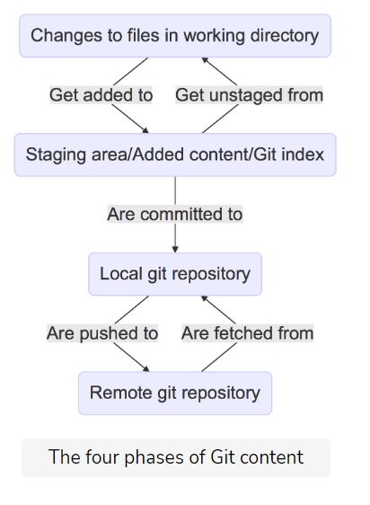
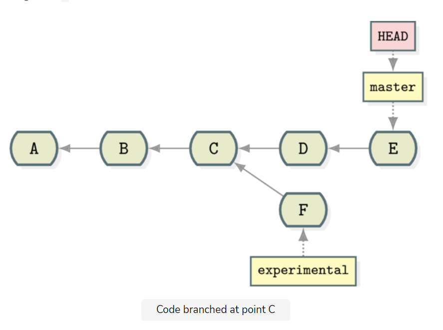
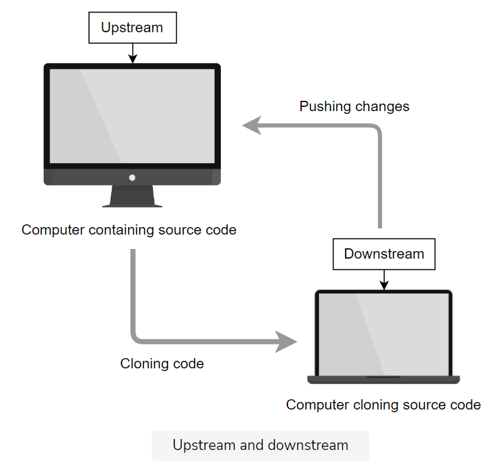
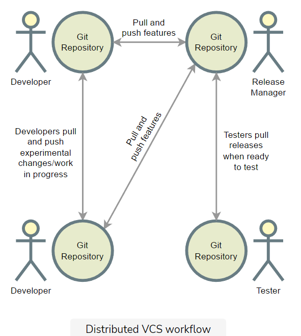

* Git is used to solve the problem of source control
>
> 4 phases of Git content

* Branches-> when someone wants to make an expiremental change but does not want to affect the main line.
>

* upstream-> from where the code is taken from. i.e if the computer is cloning from github, Github is the upstream.
* Downstream-> where the changes of the code are made on a seperate computer (clones)
>
>As with a stream of water, if you are downstream, you receive whatever floats along the water, and you have to “push” changes upstream.


* git init-> initlisies your git in that folder
```
cd .git
ls
```
* in this git folder are two important files->head and config 
* Head is the internal representation of the default master class.

git log-> creates a log of who commited and what they commited.
git status-> gives a status of all the files and their status.
git add-> command tells GIT to start tracking the files in the local index.
git clone _url_-> will clone the git repo from this repo onto your computer.
__git log --oneline__ great way to know what has gone through.
git reset-> will recover to what the git repositary looked like before

git branch->
